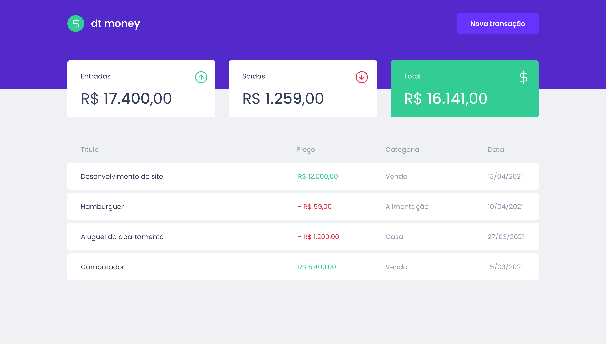
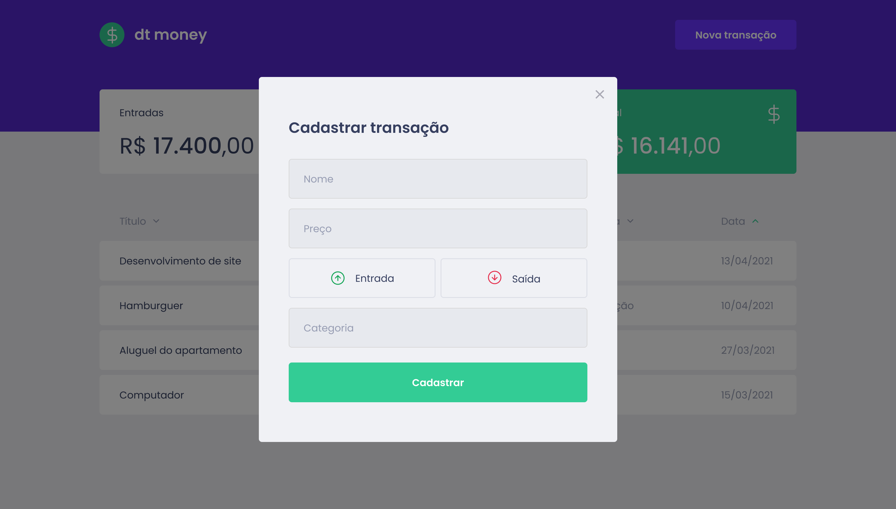
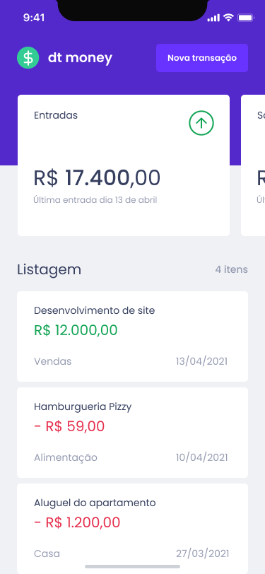
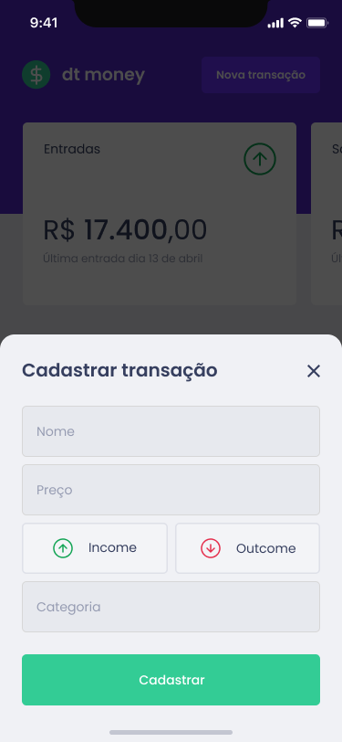

# Dt Money

Uma aplicação para o gerenciamento de finanças pessoais, esse projeto foi criado apartir da aula do ignite.

## Scripts Válidos

No diretorio do projeto, você pode rodar os seguintes scripts:

### `npm start`

Inicia o projeto no ambiente de Dev.\
Open [http://localhost:3000](http://localhost:3000) visualiza no seu navegador.

  # Tecnologias 

- React.js
- Styled Components
- Testing Library
- Typescript

# Layout - Desktop

# Dt Money

Uma aplicação para o gerenciamento de finanças pessoais, esse projeto foi criado apartir da aula do ignite.

## Scripts Válidos

No diretorio do projeto, você pode rodar os seguintes scripts:

### `npm start`

Inicia o projeto no ambiente de Dev.\
Open [http://localhost:3000](http://localhost:3000) visualiza no seu navegador.

  # Tecnologias 

- React.js
- Styled Components
- Testing Library
- Typescript

# Layout - Desktop

# Layout - Mobile

